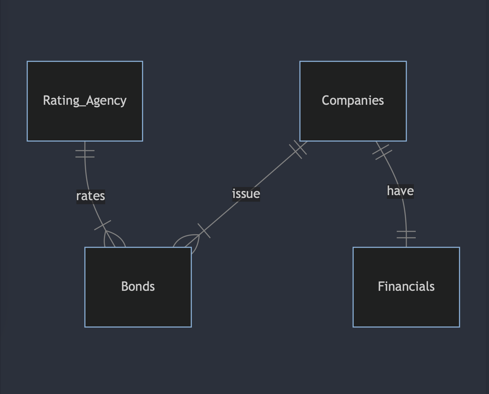

# Design Document

By Chakradhar Reddy Vonteddu

Video overview: https://youtu.be/huaORwFqylQ

## Scope

The database for this project includes everything necessary to be a guide for investors who are looking to incorporate bonds into their portfolios as well as researchers looking to build models that can forecast the credit ratings that companies would get based on their financials. As such, the database provides information about:

* Bonds, their ratings, their investment grade as well as the date they were issued
* Companies, including their name, sector and ticker
* Company financials, including a company's current ratio, operating profit margin and debt equity ratio
* Rating agencies

Some aspects that are out of scope for this database include information about a bond's maturity date, coupon rate, price etc. Moreover, the database also does not contain information about the past credit history of any company included.

## Functional Requirements

With this database, a user should be able to:

- Track a company's bond issuances and bond ratings
- Build and update their own bond portfolio by buying and selling bonds
- Analyze a company's financial health and performance

A particular capability that the database does not support is the ability to assess a given portfolio's performance.

## Representation

### Entities

The database contains the following entities:

#### Rating Agencies
The `Rating_Agency` table includes:

 * `id`, which specifies the unique ID for each rating agency as an `INTEGER`. This column therefore has the `PRIMARY KEY` constraint.
 * `Name`, which specifies the name of the rating agency. Since this is a name field, a type affinity of `TEXT` was chosen.

 #### Bonds
The `Bonds` table includes:

 * `id`, which is the unique ID assigned to each bond as an `INTEGER`. This column therefore has the `PRIMARY KEY` constraint.
 * `Rating_Agency_id`, which is the ID of the rating agency that rated the bond as an `INTEGER`. This column therefore has the `FOREIGN KEY` constraint applied, referencing the `id` column in the `Rating_Agency` table to ensure data integrity.
 * `Company_id`, which is the ID of the company that issued the bond as an `INTEGER`. This column therefore has the `FOREIGN KEY` constraint applied, referencing the `id` column in the `Companies` table to ensure data integrity.
 * `Rating`, which is the rating assigned to each bond in the form of `TEXT`. A `CHECK` constraint is applied to check that the data in the `Rating` column aligns with the data in the `Investment_Grade` column. Bonds that are BBB or above are considered investment grade bonds, which is denoted by an investment grade of 1. Bonds that are BB or below are considered junk bonds, which is denoted by an investment grade of 0.
 * `Investment_Grade`, which is a number that denotes the type of the bond as an `INTEGER`. As bonds can either be investment grade (1) or junk (0), we apply a `CHECK` constraint to ensure that the data aligns with this.
 * `Date`, which is the date of issuance for the bond which is why it has a type affinity of `DATETIME`. By default, we assign the current timestamp if no datetime is provided using the `DEFAULT` keyword.
 * `Purchased?`, which is either assigned a value of 0 if the bond has not been purchased and 1 if the bond has been purchased. A `CHECK` constraint is applied and a type affinity of `INTEGER` is chosen to ensure that only 0 or 1 values are accepted.

 If a particular column does not have the `PRIMARY KEY` or `FOREIGN KEY` constraint applied, then we also applied the `NOT NULL` constraint. No other constraints are necessary.

 #### Companies
 The `Companies` table includes:

 * `id`, which is the unique ID assigned to each company as an `INTEGER`. This column therefore has the `PRIMARY KEY` constraint.
 * `Name`, which specifies the name of the company. Since this is a name field, a type affinity of `TEXT` was chosen.
 * `Ticker`, which is the ticker symbol for a particular company stored in the form of `TEXT`. A `CHECK` constraint is applied to ensure the length of the ticker is between 1 and 5, as tickers can't have a length greater than 5.
 * `Sector`, which is a company's sector stored as `TEXT`.

 If a particular column does not have the `PRIMARY KEY` or `FOREIGN KEY` constraint applied, then we also applied the `NOT NULL` constraint. No other constraints are necessary.

#### Financials
 The `Financials` table includes:

 * `Company_id`, which is the ID of the company that issued the bond as an `INTEGER`. This column therefore has the `FOREIGN KEY` constraint applied, referencing the `id` column in the `Companies` table to ensure data integrity. We also add a `UNIQUE` constraint here to indicate that the relationship between a company and its financials should be one to one.
 * `Date`, which is the date this information was recorded stored as `DATETIME`. By default, we assign the current timestamp if no datetime is provided using the `DEFAULT` keyword.
 * `Current_Ratio`, which is a key liquidity indicator stored as `NUMERIC`. A `CHECK` constraint is applied to verify this value is greater than or equal to zero as the current assets/liabilities of a company can't be negative.
 * `Operating_Cash_Flow_PerShare`, which is a profitability indicator stored as `NUMERIC`.
 * `Operating_Profit_Margin`, which is a profitability indicator stored as `NUMERIC`. A `CHECK` constraint is applied to verify this value is less than 1 as a company's operating profits cannot exceed its revenue.
 * `Debt_Equity_Ratio`, which is a solvency indicator stored as `NUMERIC`.
 * `Enterprise_Value_Multiple`, which is a ratio used to determine the value of a company stored as `NUMERIC`.

 For all the financial indicators, a type of `NUMERIC` was chosen because these values can either be integers or floats. If a particular column does not have the `PRIMARY KEY` or `FOREIGN KEY` constraint applied, then we also applied the `NOT NULL` constraint. No other constraints are necessary.

### Relationships

The entity relationship diagram below describes the relationships among the entities in the database.

## Optimizations

Views were created to allow investors to access the collection of investment grade and junk bonds at any point of time. This was done to partition the database and facilitate easier access to a specific subsection of the entire database.

Moreover, a view was created to allow users to track the bonds they have purchased in the form of a portfolio. This, coupled with triggers that enable users to update their portfolio easily, allows for users to build and manage their own portfolios.

Lastly, indexes were added to columns that queries would access frequently. In the `Bonds` table, this was the `Rating` column and in the `Companies` table, this was the `Name` and `Ticker` column. In the `Financials` table, this was the `Current_Ratio`, `Operating_Profit_Margin`, and `Debt_Equity_Ratio` columns.

## Limitations

A limitation of this database is that it does not support one to many relationships between companies and their financials. Having access to financial information of companies at several different points in time could be helpful in tracking the financial health of a company over time.
